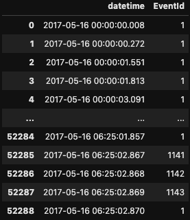

# Data Engineer Exam

## Environment

Before the test, please use `virtalenv` to build the environment. You can add the tool you want to use in `requirements.txt`.

## 1. Exam 1

You have 67 time series data in `exam1/data/time-series.zip`, some of them contain anomaly points and some are not.

Please finished `algorithm.py` that return `1` if the points your algorithm detect is anomaly else `0`, you can use *ANY* methods to detect anomalies.

## Evaluate

Execute the command below, the result will show on the `exam1/result` folder.

Anomaly points will be annotated as redpointing.

```python
cd exam1
python detector.py
```

---

## 2. Exam 2

Use [Pandas](https://pandas.pydata.org/) to transform data `exam2/data/train_need_aggregate.csv` and `exam2/data/test_need_aggregate.csv` from [Figure 1](#figure-1) to [Figure 2](#figure-2).

### Figure 1



### Figure 2


### Evaluate

Please output two files `train.csv` and `test.csv` in `exam2/result` folder via the command below:

```python
cd exam2
python main.py
```

## 3. Exam 3

1. Use deep learning framework **PyTorch** to build an LSTM Model on `model.py`.

2. Use the model you built in step 1, use the train file you aggregated in question [**Exam 2**](#2-exam-2) to train a model. Please finish `train.py` and save the model weight on `model` folder. The `train.py` should support `epochs` arguments to determine how many epochs should model trains.

   ```python
   cd exam3
   python train --epochs 10
   ```

3. (bonus1) Finish the `predict.py` to load the model weight to predict the test file you aggregated in question [**Exam 2**](#2-exam-2).

   3.1. (bonus2) Point out which time point is an anomaly. Add a column called `anomaly`, fill `1` if the point is anomaly else `0`. Output the result call `predict.csv` to `exam3/result` folder.

   ```python
   cd exam3
   python predict.py
   ```
